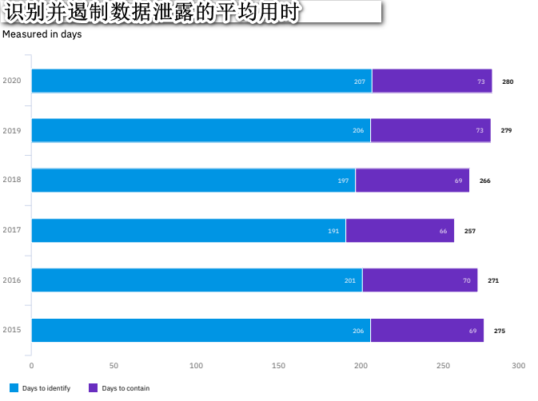

# 应用程序日志词汇

本文档提供出用于记录安全实践的标准词汇表。其目的用于简化监控与报警，假若开发人员使用此词汇表捕获并记录错误，通过这些术语归类与描述，使得监控与报警更加精确全面，得到改进。

## 概述

每年, IBM Security委托Ponemon Institute调查世界各地的公司，以获取与安全漏洞、缓解措施和相关成本相关的信息；结果称为数据泄露报告的成本。 

除了因违规行为而损失的数百万美元外，报告还发现**确定**违规行为的平均时间继续徘徊在**200天**左右。显然，提高监控应用程序并对异常行为发出警报的能力，将缩短识别攻击开始时间，并实施缓解措施。


>  IBM 2020年数据泄露成本研究，第52页, 图34, [https://www.ibm.com/security/data-breach] 

标准的日志记录通过定义特定的关键字实现，当这些关键字在软件中被一致使用时，将允许团队在所有应用程序中更简单的去监控事件术语，并对发生的攻击快速响应。

## 前提

- Observability/SRE小组必须支持使用该标准，并鼓励开发人员使用该标准
- 事件响应要么通过输入数据，要么通过其他的监控团队发送警告通知的方式，最好是编程实现这一过程.
- 架构师必须支持、采用并促进该标准
- 开发人员必须接受该标准并开始去实现(需要有一定的知识和意愿去了解潜在的攻击，并在代码中捕获这些攻击造成的错误)。

## 开始

作为提醒，日志记录的目标是能够对特定的安全事件发出警报。当然，想要记录这些事件的第一步是有良好的错误处理机制，如果你还没有实现跟踪事件的机制，更不用说去记录这些事件。

### 明确事件

一个简单的方法去更好地理解安全事件日志记录，即通过良好的高层的理解威胁建模:

1. **可能存在什么风险?**

- 订单: 某人可以代替他人下订单吗?
- 认证: 我可以作为其他人登录吗？
- 授权: 我可以看其他人的帐户信息吗？

2. **风险发生了会是什么情况?**

- 订单: 哎呀，我居然可以代表另一家公司去新泽西的一个废弃仓库下订单
- 然后我在4Chan论坛上吹嘘了这件事情 .
- 然后我告诉了《纽约时报》.

3. **谁想造成这个局面?**

- 黑客的蓄意攻击.
- 员工“测试”该功能的实现方式.
- API编写错误，做了作者不想做的事情.

## 格式化

*注意: 所有日志记录的日期均应使用**UTC偏移量格式化**['ISO 8601](https://en.wikipedia.org/wiki/ISO_8601) ，以确保最大的可移植性*

```
{
    "datetime": "2021-01-01T01:01:01-0700",
    "appid": "foobar.netportal_auth",
    "event": "AUTHN_login_success:joebob1",
    "level": "INFO",
    "description": "User joebob1 login successfully",
    "useragent": "Mozilla/5.0 (Macintosh; Intel Mac OS X 10_14_6) AppleWebKit/537.36 (KHTML, like Gecko) Chrome/78.0.3904.108 Safari/537.36",
    "source_ip": "165.225.50.94",
    "host_ip": "10.12.7.9",
    "hostname": "portalauth.foobar.com",
    "protocol": "https",
    "port": "440",
    "request_uri": "/api/v2/auth/",
    "request_method": "POST",
    "region": "AWS-US-WEST-2",
    "geo": "USA"
}
```

## 词汇表

下面是应该捕获的各种事件类型。对于每种事件类型，都有一个类似于“authn”的前缀以及该事件应包含的其他数据。

如，完整日志记录的应包含的格式，完整的事件日志应遵循上述格式。

---

## 认证 [AUTHN]

### authn_login_success[:userid]

**描述**
应记录所有登录事件，包括登录成功。

**级别:**INFO

**案例:**

```
{
    "datetime": "2019-01-01 00:00:00,000",
    "appid": "foobar.netportal_auth",
    "event": "authn_login_success:joebob1",
    "level": "INFO",
    "description": "User joebob1 login successfully",
    ...
}
```

---

### authn_login_successafterfail[:userid,retries]

**描述**
用户在先前失败后再成功登录。

**级别:** INFO

**案例:**

```
{
    "datetime": "2019-01-01 00:00:00,000",
    "appid": "foobar.netportal_auth",
    "event": "authn_login_success:joebob1,2",
    "level": "INFO",
    "description": "User joebob1 login successfully",
    ...
}
```

---

### authn_login_fail[:userid]

**描述**
应记录所有登录事件，包括登录失败。

**级别:** WARN

**案例:**

```
{
    "datetime": "2019-01-01 00:00:00,000",
    "appid": "foobar.netportal_auth",
    "event": "authn_login_fail:joebob1",
    "level": "WARN",
    "description": "User joebob1 login failed",
    ...
}
```

---

### authn_login_fail_max[:userid,maxlimit(int)]

**描述**
记录到达设定的最大登录失败次数的事件

**级别:** WARN

**案例:**

```
{
    "datetime": "2019-01-01 00:00:00,000",
    "appid": "foobar.netportal_auth",
    "event": "authn_login_fail_max:joebob1,3",
    "level": "WARN",
    "description": "User joebob1 reached the login fail limit of 3",
    ...
}
```

---

### authn_login_lock[:userid,reason]

**描述**
当存在在重试x次或其他情况下锁定帐户的功能时，应使用相关数据记录锁定事件。

**级别:** WARN

**原因:**

- maxretries:已达到最大重试次数 
- suspicious: 在账户上观察到可疑活动
- customer: 客户要求锁定他们的帐户
- other: 其他

**案例:**

```
{
    "datetime": "2019-01-01 00:00:00,000",
    "appid": "foobar.netportal_auth",
    "event": "authn_login_lock:joebob1,maxretries",
    "level": "WARN",
    "description": "User joebob1 login locked because maxretries exceeded",
    ...
}
```

---

### authn_token_delete[:appid]

**描述**
删除令牌时，应记录该令牌

**级别:** WARN

**案例:**

```
{
    "datetime": "2019-01-01 00:00:00,000",
    "appid": "foobar.netportal_auth",
    "event": "authn_token_delete:foobarapi",
    "level": "WARN",
    "description": "The token for foobarapi has been deleted",
    ...
}
```

---

### authn_password_change[:userid]

**描述**
每次密码变更都应该被记录，包括它的用户ID。

**级别:** INFO

**案例:**

```
{
    "datetime": "2019-01-01 00:00:00,000",
    "appid": "foobar.netportal_auth",
    "event": "authn_password_change:joebob1",
    "level": "INFO",
    "description": "User joebob1 has successfully changed their password",
    ...
}
```

---

### authn_impossible_travel[:userid,region1,region2]

**描述**

当用户在一个城市登录后，突然在另一个城市(用该用户凭证身份)继续使用应用，且城市间距离很远，无法在合理的事件范围内到达时，这通常意味着该账户可能被接管。

**级别:** CRITICAL

**案例:**

```
{
    "datetime": "2019-01-01 00:00:00,000",
    "appid": "foobar.netportal_auth",
    "event": "authn_impossible_travel:joebob1,US-OR,CN-SH",
    "level": "CRITICAL",
    "description": "User joebob1 has accessed the application in two distant cities at the same time",
    ...
}
```

---

### authn_token_created[:userid, entitlement(s)]

**描述**
当访问某服务并创建访问令牌时，应进行记录。

**级别:** INFO

**案例:**

```
{
    "datetime": "2019-01-01 00:00:00,000",
    "appid": "aws.foobar.com",
    "event": "authn_token_created:app.foobarapi.prod,create,read,update",
    "level": "INFO",
    "description": "A token has been created for app.foobarapi.prod with create,read,update",
    ...
}
```

---

### authn_token_revoked[:userid,tokenid]

**描述**
给定帐户的令牌已被吊销。

> 注: 这儿是指令牌过期后，被吊销时，进行日志记录

**级别:**: INFO

**案例:**

```
{
    "datetime": "2019-01-01 00:00:00,000",
    "appid": "aws.foobar.com",
    "event": "authn_token_revoked:app.foobarapi.prod,xyz-abc-123-gfk",
    "level": "INFO",
    "description": "Token ID: xyz-abc-123-gfk was revoked for user app.foobarapi.prod",
    ...
}
```

---

### authn_token_reuse[:userid,tokenid]

**描述**
试图重用已吊销的令牌。

> 注: 这儿指某用户使用一个已吊销的令牌尝试获取某个服务时，进行日志记录

**级别:**: CRITICAL

**案例:**

```
{
    "datetime": "2019-01-01 00:00:00,000",
    "appid": "aws.foobar.com",
    "event": "authn_token_reuse:app.foobarapi.prod,xyz-abc-123-gfk",
    "level": "CRITICAL",
    "description": "User app.foobarapi.prod attempted to use token ID: xyz-abc-123-gfk which was previously revoked",
    ...
}
```

---

## 授权 [AUTHZ]

---

### authz_fail[:userid,resource]

**描述**
试图访问未经授权的资源

**级别:**: CRITICAL

**案例:**

```
{
    "datetime": "2019-01-01 00:00:00,000",
    "appid": "foobar.netportal_auth",
    "event": "authz_fail:joebob1,resource",
    "level": "CRITICAL",
    "description": "User joebob1 attempted to access a resource without entitlement",
    ...
}
```

---

### authz_change[:userid,from,to]

**描述**
用户或实体的权限发生变更

**级别:**: WARN

**案例:**

```
{
    "datetime": "2019-01-01 00:00:00,000",
    "appid": "foobar.netportal_auth",
    "event": "authz_change:joebob1,user,admin",
    "level": "WARN",
    "description": "User joebob1 access was changed from user to admin",
    ...
}
```

---

### authz_admin[:userid,event]

**描述**
应记录管理员等特权用户的所有活动。

**级别:**: WARN

**案例:**

```
{
    "datetime": "2019-01-01 00:00:00,000",
    "appid": "foobar.netportal_auth",
    "event": "authz_admin:joebob1,user_privilege_change",
    "level": "WARN",
    "description": "Administrtator joebob1 has updated privileges of user foobarapi from user to admin",
    ...
}
```

---

## 超额使用 [EXCESS]

### excess_rate_limit_exceeded[userid,max]

**描述**

即使只是为了管理成本与控制规模，也应该对服务设立预期的限额，并在超出使用上限时发出警报。

**级别:**: WARN

**案例:**

```
{
    "datetime": "2019-01-01 00:00:00,000",
    "appid": "foobar.netportal_auth",
    "event": "excess_rate_limit_exceeded:app.foobarapi.prod,100000",
    "level": "WARN",
    "description": "User app.foobarapi.prod has exceeded max:100000 requests",
    ...
}
```

---

## 文件上传 [UPLOAD]

### upload_complete[userid,filename,type]

**描述**
成功上载文件后，验证过程的第一步是上传已完成。

**级别:**: INFO

**案例:**

```
    {
    "datetime": "2019-01-01 00:00:00,000",
    "appid": "foobar.netportal_auth",
    "event": "upload_complete:joebob1,user_generated_content.png,PNG",
    "level": "INFO",
    "description": "User joebob1 has uploaded user_generated_content.png",
    ...
}
```

---

### upload_stored[filename,from,to]

**描述**

良好的文件上传验证过程中，需要有一个步骤用于移动/重命名上传的文件，当向最终的用户提供文件内容时，不要在下载接口中引用原始文件名。这同样适用于文件系统和块存储。

**级别:**: INFO

**案例:**

```
{
    "datetime": "2019-01-01 00:00:00,000",
    "appid": "foobar.netportal_auth",
    "event": "upload_stored:user_generated_content.png,kjsdhkrjhwijhsiuhdf000010202002",
    "level": "INFO",
    "description": "File user_generated_content.png was stored in the database with key abcdefghijk101010101",
    ...
}
```

---

### upload_validation[filename,(virusscan|imagemagick|...):(FAILED|incomplete|passed)]

**描述**

所有的文件上传都应该进行一些验证，以确保正确性，如验证文件是否实际上为x类型文件，和是否是健康的(不包含病毒)。

**级别:**: INFO|CRITICAL

**案例 :**

```
{
    "datetime": "2019-01-01 00:00:00,000",
    "appid": "foobar.netportal_auth",
    "event": "upload_validation:filename,virusscan:FAILED",
    "level": "CRITICAL",
    "description": "File user_generated_content.png FAILED virus scan and was purged",
    ...
}
```

---

### upload_delete[userid,fileid]

**描述**
由于正常原因删除文件时，应记录该文件。

**级别:**: INFO

**案例:**

```
{
    "datetime": "2019-01-01 00:00:00,000",
    "appid": "foobar.netportal_auth",
    "event": "upload_delete:joebob1,",
    "level": "INFO",
    "description": "User joebob1 has marked file abcdefghijk101010101 for deletion.",
    ...
}
```

---

## 输入验证 [INPUT]

### input_validation_fail[:field,userid]

**描述**
当服务器端的输入验证失败时，原因可能是a）客户端没有提供足够的验证，或者b）客户端验证被绕过。无论哪种情况，这都是一个攻击的场景，应该迅速缓解。

> 注： a情况代表攻击者没有识别到客户端携带的类似于csrftoken或者一些完整性校验的字段， b情况代表攻击者可以模拟客户端请求，但是上传的数据携带非法数据，被服务端校验逻辑发现

**级别:** WARN

**案例:**

```
{
    "datetime": "2019-01-01 00:00:00,000",
    "appid": "foobar.netportal_auth",
    "event": "input_validation_fail:date_of_birth,joebob1",
    "level": "WARN",
    "description": "User joebob1 submitted data that failed validation.",
    ...
}
```

---

## 恶意行为 [MALICIOUS

### malicious_excess_404:[userid|IP,useragent]

**描述**
当用户对不存在的文件发出大量请求时，它通常表示试图“强制浏览”可能存在的文件，并且通常是表示恶意意图的行为。 

> 注: “强制浏览” 或理解为"枚举"， 即在大量枚举可能存在的文件，但字典中不存在的文件为大多数，所以服务端看到的就是对大量不存在的文件发起请求

**级别:** WARN

**案例:**

```
{
    "datetime": "2019-01-01 00:00:00,000",
    "appid": "foobar.netportal_auth",
    "event": "malicious_excess404:123.456.789.101,M@l1c10us-Hax0rB0t0-v1",
    "level": "WARN",
    "description": "A user at 123.456.789.101 has generated a large number of 404 requests.",
    ...
}
```

---

### malicious_extraneous:[userid|IP,inputname,useragent]

**描述**

当用户向后端处理程序提交非预期的数据时，可能表示其正在探测输入验证错误处理机制。如果您的后端服务接收到数据，但它没有处理或没有输入，这表明可能正存在恶意滥用。

**级别:** WARN

**案例:**

```
{
    "datetime": "2019-01-01 00:00:00,000",
    "appid": "foobar.netportal_auth",
    "event": "malicious_extraneous:dr@evil.com,creditcardnum,Mozilla/5.0 (X11; Linux x86_64; rv:10.0) Gecko/20100101 Firefox/10.0",
    "level": "WARN",
    "description": "User dr@evil.com included field creditcardnum in the request which is not handled by this service.",
    ...
}
```

---

### malicious_attack_tool:[userid|IP,toolname,useragent]

**描述**

通过带有明显签名或user-agent头特征所能识别的攻击工具发起的请求行为，应进行记录。

**待规划:** A future version of this standard should link to known attack tools, signatures and user-agent strings. For instance, the tool "Nikto" leaves behind its user agent by default with a string like ***"Mozilla/5.00 (Nikto/2.1.6) (Evasions:None) (Test:Port Check)"***

**级别:** WARN

**案例:**

```
{
    "datetime": "2019-01-01 00:00:00,000",
    "appid": "foobar.netportal_auth",
    "event": "malicious_attack_tool:127.0.0.1,nikto,Mozilla/5.00 (Nikto/2.1.6) (Evasions:None) (Test:Port Check)",
    "level": "WARN",
    "description": "Attack traffic indicating use of Nikto coming from 127.0.0.1",
    ...
}
```

---

### malicious_cors:[userid|IP,useragent,referer]

**描述**

阻止来自未授权源(cors)发起尝试请求(资源)的动作，也应该尽可能记录该事件。我们阻止了一个非法的跨源请求，请求被发出的事实即可能是攻击的迹象。

*注意: 补充一个小姿势，您知道“referer”一词在原始HTTP规范中属于拼写错误吗？正确的拼写应该是“referrer”，但最初的拼写错误一直持续到今天，并被人们故意使用.*

**级别:**WARN

**案例:**

```
{
    "datetime": "2019-01-01 00:00:00,000",
    "appid": "foobar.netportal_auth",
    "event": "malicious_cors:127.0.0.1,Mozilla/5.0 (X11; Linux x86_64; rv:10.0) Gecko/20100101 Firefox/10.0,attack.evil.com",
    "level": "WARN",
    "description": "An illegal cross-origin request from 127.0.0.1 was referred from attack.evil.com"
    ...
}
```

---

### malicious_direct_reference:[userid|IP, useragent]

**描述**

 针对身份验证和授权的常见攻击是在没有凭据(垂直越权)或适当访问权限的情况(水平越权)下直接访问对象。此漏洞曾经是OWASP十大漏洞之一，称为**不安全的直接对象引用(IDOR)**。假设您已正确阻止了此攻击，则记录尝试利用此攻击的恶意用户会很有价值。

**级别:** WARN

**案例:**

```
{
    "datetime": "2019-01-01 00:00:00,000",
    "appid": "foobar.netportal_auth",
    "event": "malicious_direct:joebob1, Mozilla/5.0 (X11; Linux x86_64; rv:10.0) Gecko/20100101 Firefox/10.0",
    "level": "WARN",
    "description": "User joebob1 attempted to access an object to which they are not authorized",
    ...
}
```

---

## 权限变更 [PRIVILEGE]

本节重点讨论对象的权限变更，例如文件的读/写/执行或数据库中授权元信息的变更。

“用户管理”部分介绍了对用户/帐户的变更如何进行日志记录。

---

### privilege_permissions_changed:[userid,file|object,fromlevel,tolevel]

**描述**

跟踪存在访问控制限制的对象的变更情况，可以发现未经授权的用户试图在这些文件上提权。 

**级别: **WARN

**案例:**

```
{
    "datetime": "2019-01-01 00:00:00,000",
    "appid": "foobar.netportal_auth",
    "event": "malicious_direct:joebob1, /users/admin/some/important/path,0511,0777",
    "level": "WARN",
    "description": "User joebob1 changed permissions on /users/admin/some/important/path",
    ...
}
```

---

## 敏感数据变更 [DATA]

不必记录所有文件的变更或发出警报，但对于高度敏感的文件或数据，我们必须监控变更情况并发出警报。 

---

### sensitive_create:[userid,file|object]

**描述**
所有标记为敏感的数据或放置在存储敏感数据的目录/表/存储库中的数据的创建动作，都应进行记录并定期审查。

**级别:** WARN

**案例:**

```
{
    "datetime": "2019-01-01 00:00:00,000",
    "appid": "foobar.netportal_auth",
    "event": "sensitive_create:joebob1, /users/admin/some/important/path",
    "level": "WARN",
    "description": "User joebob1 created a new file in /users/admin/some/important/path",
    ...
}
```

---

### sensitive_read:[userid,file|object]

**描述**
所有标记为敏感的数据或放置在存储敏感数据的目录/表/存储库中的数据的访问动作，都应进行记录并定期审查。

**级别:** WARN

**案例:**

```
{
    "datetime": "2019-01-01 00:00:00,000",
    "appid": "foobar.netportal_auth",
    "event": "sensitive_read:joebob1, /users/admin/some/important/path",
    "level": "WARN",
    "description": "User joebob1 read file /users/admin/some/important/path",
    ...
}
```

---

### sensitive_update:[userid,file|object]

**描述**
所有标记为敏感的数据或放置在存储敏感数据的目录/表/存储库中的数据的更新动作，都应进行记录并定期审查。

**级别:** WARN

**案例:**

```
{
    "datetime": "2019-01-01 00:00:00,000",
    "appid": "foobar.netportal_auth",
    "event": "sensitive_update:joebob1, /users/admin/some/important/path",
    "level": "WARN",
    "description": "User joebob1 modified file /users/admin/some/important/path",
    ...
}
```

---

### sensitive_delete:[userid,file|object]

**描述**
所有标记为敏感的数据或放置在存储敏感数据的目录/表/存储库中的数据的删除动作，都应进行记录并定期审查。文件不应立即删除，而应标记为删除，并应根据法律/隐私要求保存文件档案。

**级别:** WARN

**案例:**

```
{
    "datetime": "2019-01-01 00:00:00,000",
    "appid": "foobar.netportal_auth",
    "event": "sensitive_delete:joebob1, /users/admin/some/important/path",
    "level": "WARN",
    "description": "User joebob1 marked file /users/admin/some/important/path for deletion",
    ...
}
```

---

## 错序 [SEQUENCE]

也称为***业务逻辑攻击***，例如执行一段业务有着一段预期设定的执行顺序或路径，但攻击者试图跳过或变更执行顺序或路径，则表明可能存在恶意意图。

---

### sequence_fail:[userid]

**描述**
待规划

**级别:** WARN

**案例:**

```
{
    "datetime": "2019-01-01 00:00:00,000",
    "appid": "foobar.netportal_auth",
    "event": "malicious_direct:joebob1, /users/admin/some/important/path,0511,0777",
    "level": "WARN",
    "description": "User joebob1 changed permissions on /users/admin/some/important/path",
    ...
}
```

---

## 会话管理 [SESSION]

### session_created:[userid]

**描述**
当新的认证会话被创建时，可以记录该会话并监控其活动。

**级别:** INFO

**案例:**

```
    {
    "datetime": "2019-01-01 00:00:00,000",
    "appid": "foobar.netportal_auth",
    "event": "session_created:joebob1",
    "level": "INFO",
    "description": "User joebob1 has started a new session",
    ...
}
```

---

### session_renewed:[userid]

**描述 **
当用户收到会话将过期/吊销的警告并选择延续其会话时，应记录该事件。此外，如果所讨论的系统包含高度机密的数据，那么延续会话可能需要额外的验证。

**级别:** INFO

**案例:**

```
{
    "datetime": "2019-01-01 00:00:00,000",
    "appid": "foobar.netportal_auth",
    "event": "session_renewed:joebob1",
    "level": "WARN",
    "description": "User joebob1 was warned of expiring session and extended.",
    ...
}
```

---

### session_expired:[userid,reason]

**描述**

当会话到期时，特别是在经过身份验证的会话或具有敏感数据的情况下，可以记录该会话到期并清理所包含的敏感数据。原因码可以是任何原因码，例如：注销、超时、吊销等。如果需要吊销会话，则会话不应被删除，而应让其过期。

**级别:** INFO

**案例:**

```
{
    "datetime": "2019-01-01 00:00:00,000",
    "appid": "foobar.netportal_auth",
    "event": "session_expired:joebob1,revoked",
    "level": "WARN",
    "description": "User joebob1 session expired due to administrator revocation.",
    ...
}
```

---

### session_use_after_expire:[userid]

**描述**

如果用户试图使用过期会话访问系统，尤其是在之后又出现登录失败的情况下，日志记录是有效的。这可以识别恶意用户试图劫持会话或直接访问另一个人的计算机/浏览器的情况。

> 注： 场景可能是这样的，某个正常用户长时间未使用，突然使用，则会话过期导致页面让其重新登录，其重新登录。但对于恶意用户而言，使用过期会话后，让其重新登录，由于其只窃取到过期会话，无法登录成功。

**级别:** WARN

**案例:**

```
{
    "datetime": "2019-01-01 00:00:00,000",
    "appid": "foobar.netportal_auth",
    "event": "session_use_after_expire:joebob1",
    "level": "WARN",
    "description": "User joebob1 attempted access after session expired.",
    ...
}
```

---

## 系统事件 [SYS]

### sys_startup:[userid]

**描述**

即使系统是无服务器或容器，当系统启动时，记录启动是很有价值的。若可能，尤其要记录启动系统的用户。

**级别:** WARN

**案例:**

```
{
    "datetime": "2019-01-01 00:00:00,000",
    "appid": "foobar.netportal_auth",
    "event": "sys_startup:joebob1",
    "level": "WARN",
    "description": "User joebob1 spawned a new instance",
    ...
}
```

---

### sys_shutdown:[userid]

**描述**
即使系统是无服务器或容器，当系统关闭时，记录关闭是很有价值的。若可能，尤其要记录关闭系统的用户。

**级别:** WARN

**案例:**

```
{
    "datetime": "2019-01-01 00:00:00,000",
    "appid": "foobar.netportal_auth",
    "event": "sys_shutdown:joebob1",
    "level": "WARN",
    "description": "User joebob1 stopped this instance",
    ...
}
```

---

### sys_restart:[userid]

**描述**
即使系统是无服务器或容器，当系统重启时，记录重启是很有价值的。若可能，尤其要记录重启系统的用户。

**级别:** WARN

**案例:**

```
{
    "datetime": "2019-01-01 00:00:00,000",
    "appid": "foobar.netportal_auth",
    "event": "sys_restart:joebob1",
    "level": "WARN",
    "description": "User joebob1 initiated a restart",
    ...
}
```

---

### sys_crash[:reason]

**描述**
捕获导致系统崩溃的不稳定状态，记录该事件可能会有所帮助，尤其是当该事件由攻击触发时。 

**级别:** WARN

**案例:**

```
{
    "datetime": "2019-01-01 00:00:00,000",
    "appid": "foobar.netportal_auth",
    "event": "sys_crash:outofmemory,
    "level": "WARN",
    "description": "The system crashed due to Out of Memory error.",
    ...
}
```

---

### sys_monitor_disabled:[userid,monitor]

**描述**

如果您的系统包含负责文件完整性、资源、日志记录、病毒等的客户端监控程序(agent)，那么了解它们是否被停止以及由谁停止尤为重要。 

**级别:** WARN

**案例:**

```
{
    "datetime": "2019-01-01 00:00:00,000",
    "appid": "foobar.netportal_auth",
    "event": "sys_monitor_disabled:joebob1,crowdstrike",
    "level": "WARN",
    "description": "User joebob1 has disable CrowdStrike",
    ...
}
```

---

### sys_monitor_enabled:[userid,monitor]

**描述**
待规划

**级别:**
WARN

**案例:**

```
{
    "datetime": "2019-01-01 00:00:00,000",
    "appid": "foobar.netportal_auth",
    "event": "sys_monitor_enabled:joebob1,crowdstrike",
    "level": "WARN",
    "description": "User joebob1 has enabled CrowdStrike",
    ...
}
```

---

## 用户管理 [USER]

### user_created:[userid,newuserid,attributes[one,two,three]]

**描述**
创建新用户时，记录用户创建事件的详细信息非常有用，特别是在当用户通过管理员权限所创建。 

**级别:**
WARN

**案例:**

```
{
    "datetime": "2019-01-01 00:00:00,000",
    "appid": "foobar.netportal_auth",
    "event": "user_created:joebob1,user1,admin:create,update,delete",
    "level": "WARN",
    "description": "User joebob1 created user1 with admin:create,update,delete privilege attributes",
    ...
}
```

---

### user_updated:[userid,onuserid,attributes[one,two,three]]

**描述**
更新新用户时，记录用户更新事件的详细信息非常有用，特别是在当用户通过管理员权限所更新。 

**级别:** WARN

**案例:**

```
{
    "datetime": "2019-01-01 00:00:00,000",
    "appid": "foobar.netportal_auth",
    "event": "user_updated:joebob1,user1,admin:create,update,delete",
    "level": "WARN",
    "description": "User joebob1 updated user1 with attributes admin:create,update,delete privilege attributes",
    ...
}
```

---

### user_archived:[userid,onuserid]

**描述**
除非需要，否则最好将用户存档，而不是删除。存档用户时，记录用户存档事件的详细信息很有帮助。恶意用户可以使用此功能拒绝向合法用户提供服务。

**级别:** WARN

**案例:**

```
{
    "datetime": "2019-01-01 00:00:00,000",
    "appid": "foobar.netportal_auth",
    "event": "user_archived:joebob1,user1",
    "level": "WARN",
    "description": "User joebob1 archived user1",
    ...
}
```

---

### user_deleted:[userid,onuserid]

**描述**
除非需要，否则最好将用户存档，而不是删除。删除用户时，记录用户删除事件的详细信息很有帮助。恶意用户可以使用此功能拒绝向合法用户提供服务。

**级别:** WARN

**案例:**

```
{
    "datetime": "2019-01-01 00:00:00,000",
    "appid": "foobar.netportal_auth",
    "event": "user_deleted:joebob1,user1",
    "level": "WARN",
    "description": "User joebob1 has deleted user1",
    ...
}
```

---

## 其他

和你记录什么一样重要的是你没有记录什么。不得记录私人或机密信息、源代码、密钥、证书等。

> 注: 译者亲有体会，日志中若存在敏感数据，攻击者通过文件读取等方式可以大大提升攻击危害。日志记录中会话这种也尽量用掩码或者ID映射的方式进行记录

有关应排除在日志记录之外的全面概述，请参阅 [日志记录](../cheatsheets/logging_Cheat_Sheet.md#data-to-exclude) 章节