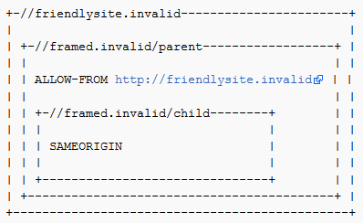

# 防范点击劫持

## 介绍

本备忘单旨在为开发者提供关于如何防御 [点击劫持](https://owasp.org/www-community/attacks/Clickjacking)的指导，也称为用户界面伪装攻击。

有三种主要机制可用于防御这些攻击：

- 使用 [X-Frame-Options](https://developer.mozilla.org/en-US/docs/Web/HTTP/Headers/X-Frame-Options) 或 [Content Security Policy (frame-ancestors)](https://developer.mozilla.org/en-US/docs/Web/HTTP/Headers/Content-Security-Policy/frame-ancestors) HTTP 头来阻止浏览器使用frame加载([D]自己的）页面.
- 使用 [SameSite](https://developer.mozilla.org/en-US/docs/Web/HTTP/Headers/Set-Cookie/SameSite) cookie 属性，阻止会话cookie被使用frame加载的页面的请求所调用
- 在页面中实现JavaScript代码，试图阻止它被加载到一个frame中（称为“frame-buster”）

请注意，这些机制都是相互独立的，在可能的情况下，应实施多个机制，以便提供纵深防御。

## 通过内容安全策略 (CSP) frame-ancestors指令进行保护

`frame-ancestors` 指令可在内容安全策略HTTP响应头中使用，以指示是否应允许浏览器在`<frame>`或`<iframe>`中呈现页面。网站可以通过确保其内容不被嵌入到其他网站来避免点击劫持攻击。 

`frame-ancestors`允许站点使用正常的内容安全策略语义授权多个域。 

### Content-Security-Policy: frame-ancestors 示例

常见的CSP frame-ancestors用法:

- `Content-Security-Policy: frame-ancestors 'none';`
    - 这将防止任何域使用frame加载内容。除非确定了特定的frame需求，否则建议使用此设置。
- `Content-Security-Policy: frame-ancestors 'self';`
    - 这将仅允许当前站点的frame加载内容
- `Content-Security-Policy: frame-ancestors 'self' *.somesite.com https://myfriend.site.com;`
    - 允许当前站点， `somesite.com` （任意协议）， `myfriend.site.com`（使用HTTPS，默认端口为443）下的frame加载内容

请注意，在`self`和`none`使用时需要单引号包裹，但在其他源表达式周围可能不会出现单引号。


有关更多详细信息和更复杂的示例，请参阅以下文档：

See the following documentation for further details and more complex examples:

- <https://w3c.github.io/webappsec-csp/#directive-frame-ancestors>
- <https://developer.mozilla.org/en-US/docs/Web/HTTP/Headers/Content-Security-Policy/frame-ancestors>

### 局限性

- **浏览器兼容:** CSP frame-ancestors 还未被所有主流浏览器支持。
- **优先考虑X-Frame-Options:** [Section "Relation to X-Frame-Options" of the CSP Spec](https://w3c.github.io/webappsec/specs/content-security-policy/#frame-ancestors-and-frame-options) 说到: *如果资源交付的策略包含名为frame-ancestors 指令，其处置方式为“强制”，则必须忽略X-frame-Options头*”，但Chrome 40和Firefox 35却是忽略frame-ancestors 指令，而是遵循X-frame-Options标头。

## 通过X-Frame-Options响应头进行保护

 `X-Frame-Options` HTTP 响应头可用于指示是否允许浏览器在`<frame>`或`<iframe>`中呈现页面。网站可以通过确保其内容不嵌入其他网站来避免点击劫持攻击。为包含HTML内容的所有响应包设置X-Frame-Options标题。可能的值是“DENY”、“SAMEORIGIN”或“ALLOW-FROM-uri”

### X-Frame-Options头类型

X-Frame-Options头有三个可能的值：

- **DENY**, 这会阻止任何域下的frame加载本站点内容。建议使用“拒绝”设置，除非确定了特定的框架需求。
- **SAMEORIGIN**, 这只允许当前网站对内容进行frame加载
- **ALLOW-FROM uri**, 允许指定的“uri” frame此页面。（例如，`ALLOW-FROMhttp://www.example.com`).
    - 检查下面的限制，因为如果浏览器不支持它，它将无法打开。
    - 其他浏览器支持新的[CSP frame-ancestors 指令](https://w3c.github.io/webappsec-csp/#directive-frame-ancestors) ， 很少两者能同时支持的
    

### 浏览器兼容性

下列的[浏览器](https://caniuse.com/#search=X-Frame-Options) 支持 X-Frame-Options 头.

参考:

- [Mozilla Developer Network](https://developer.mozilla.org/en-US/docs/HTTP/X-Frame-Options)
- [IETF Draft](http://datatracker.ietf.org/doc/draft-ietf-websec-x-frame-options/)
- [X-Frame-Options Compatibility Test](https://erlend.oftedal.no/blog/tools/xframeoptions/) - 检查此项以获取X-Frame-Options头的最新浏览器支持信息

### 实施

要实现这种保护，您需要将`X-Frame-Options`HTTP响应头添加到任何要通过framebusting防止点击劫持的页面。一种方法是将HTTP响应头手动添加到每个页面。一种可能更简单的方法是实现一个过滤器，自动将头添加到每个页面，或者将其添加到Web/Application Server级别的Web Application Firewall。

### 常见的错误防御

Meta-tags使用X-Frame-Options指令是无效的。例如，`<meta-http equiv=“X-Frame-Options”content=“deny”>`将不起作用。如上所述，必须将X-FRAME-OPTIONS指令作为HTTP响应头应用。

### 局限性

- **页策略规范**：需要为每页指定策略，这可能会使部署复杂化。例如，在登录时为整个网站提供强制执行功能，可以简化采用。
- **多域网站的问题**：当前的实现不允许网站管理员提供允许frame页面的域列表。虽然列出允许的域可能很危险，但在某些情况下，网站管理员可能别无选择，只能使用多个主机名。
- **ALLOW-FROM 浏览器兼容**: ALLOW-FROM选项是一个相对较新的添加项（大约2012年），可能还不被所有浏览器支持。注意不要依赖于“ALLOW-FROM”。如果您应用了它，而浏览器不支持它，那么您将没有点击拦截防御。
- **不支持多个选项**：无法允许当前站点和第三方站点frame相同的响应。浏览器只支持一个X-Frame-Options头和该头上的一个值。
- **嵌套框架不适用于SAMEORIGIN和ALLOW-FROM**：在以下情况下`http://framed.invalid/child`框架不会加载，因为“ALLOW-FROM”应用于顶级浏览上下文，而不是直接父级的浏览上下文。解决方案是在父框架和子框架中都使用ALLOW-FROM（但如果`//framed.invalid/parent`页面作为顶级文档加载，这将阻止子框架加载）。



- **X-Frame-Options已被弃用**：虽然主要浏览器支持X-Frame-Options标头，但它从未被标准化，并且已被弃用，取而代之的是CSP 2级规范中的frame-ancestors指令。 
- **代理**：Web代理因添加和剥离HTTP头而臭名昭著。如果web代理删除X-Frame-Options头，则网站将失去frame保护。 

## 通过SameSite Cookies防御

 [RFC 6265bis](https://tools.ietf.org/html/draft-ietf-httpbis-rfc6265bis-02#section-5.3.7) 中定义的`SameSite`cookie属性主要用于防御 [cross-site request forgery (CSRF)](Cross-Site_Request_Forgery_Prevention_Cheat_Sheet.md#samesite-cookie-attribute); 不过，它也可以提供针对点击劫持攻击的保护。

`SameSite`属性为“strict”或“lax”的cookie,将不被`<iframe>`内的页面发出的请求携带。这意味着，如果会话cookie被标记为`SameSite·，则任何需要对受害者进行身份验证的点击劫持攻击都将不起作用，因为cookie将不会被发送。 [Netsparker 博客](https://www.netsparker.com/blog/web-security/same-site-cookie-attribute-prevent-cross-site-request-forgery/)上的一篇文章提供有关使用不同SameSite策略会发送哪些类型的请求Cookie，提供进一步详细信息。

 [JavaScript.info website](https://javascript.info/clickjacking#samesite-cookie-attribute).上讨论了这种方法。

### 局限性

如果点击劫持攻击不需要对用户进行身份验证，则此属性将不提供任何保护。


此外，[大多数现代浏览器](https://caniuse.com/#feat=same-site-cookie-attribute)都支持`SameSite`属性，仍有一些用户（截至2020年11月，约6%）的浏览器不支持它。


使用该属性应被视为纵深防御方法的一部分，不应将其作为防止点击劫持的唯一保护措施。

## 当下最适用于传统浏览器的Frame保护脚本

防止点击劫持的一种方法是在每个不应该被frame的页面中包含一个“frame-breaker”脚本。以下方法将防止网页在不支持X-Frame-Options-Header的传统浏览器中被fra,e。 

在document HEAD元素中，添加以下内容： 

首先将ID应用于样式元素本身： 

```html
<style id="antiClickjack">
    body{display:none !important;}
</style>
```

 然后，在脚本中立即按其ID删除该样式： 

```html
<script type="text/javascript">
    if (self === top) {
        var antiClickjack = document.getElementById("antiClickjack");
        antiClickjack.parentNode.removeChild(antiClickjack);
    } else {
        top.location = self.location;
    }
</script>
```

这样，所有内容都可以放在document HEAD中，而API中只需要一个方法/标记库。

([D] 简单描述下上述脚本的功能，通过判断self===top确认是否在frame内所加载，若是则激活style，style会将整个body隐藏)

## window.confirm()保护机制

使用X-Frame-Options或“frame-breaker”脚本是一种更安全的点击保护方法。然而，在内容必须是可frame的场景中，则需要一个 `window.confirm()`通过通知用户他们将要执行的操作来帮助减轻点击劫持。

调用 `window.confirm()`将显示一个无法设置边框的弹出窗口。如果你打开源于iframe中的一个域，该域与父域不同，然后 `window.confirm()`拉起对话框将显示窗口中的域。在这种情况下，浏览器会显示对话框的来源，以帮助减轻点击劫持攻击。应该注意的是，Internet Explorer是已知的唯一一个不显示窗口中的域的浏览器，要使用Internet Explorer解决此问题，请确保对话框中的消息包含有关正在执行的操作类型的上下文信息。例如：

```html
<script type="text/javascript">
   var action_confirm = window.confirm("Are you sure you want to delete your youtube account?")
   if (action_confirm) {
       //... Perform action
   } else {
       //... The user does not want to perform the requested action.`
   }
</script>
```

## 不要使用不安全且无效的Scripts

考虑下面的片段，它不被推荐用于防范点击劫持：

```html
<script>if (top!=self) top.location.href=self.location.href</script>
```

这个简单的frame-breaker脚本试图通过强制父窗口加载当前框架的URL来防止页面被合并到frame或iframe中。不幸的是，击败这种类型脚本的多种方法已经公开。我们在这里概述一些。

### 双重 Framing

一些frame-breaker技术通过给`parent.location`赋值来导航到正确的页面。如果受害者页面是由一个页面构成的，那么这种方法效果很好。但是，如果攻击者将受害者包围在frame内的另一个frame内（双frame），则访问`parent.location`在所有流行浏览器中都会成为安全冲突，由于**descendant frame 导航策略**。此安全违规将禁用导航。

**受害者frame busting 代码:**

```javascript
if(top.location != self.location) {
    parent.location = self.location;
}
```

**攻击者 顶级 frame:**

```html
<iframe src="attacker2.html">
```

**攻击者 子-frame:**

```html
<iframe src="http://www.victim.com">
```

### onBeforeUnload事件

用户可以手动取消frame页面提交的任何导航请求。为了利用这一点，frame页面注册了一个`onBeforeUnload`处理程序，每当由于导航(跳转)原因frame页面即将卸载时，就会调用该处理程序。handler函数返回一个字符串，该字符串将成为向用户显示的提示的一部分。


假设攻击者想陷害PayPal。他注册了一个unload handler函数，返回字符串“您想退出PayPal吗？”。当该字符串显示给用户时，用户可能会取消导航，从而挫败PayPal的frame-busting。


攻击者通过使用以下代码在首页上注册unload 事件来装载此攻击：

```html
<script>
    window.onbeforeunload = function(){
        return "Asking the user nicely";
    }
</script>

<iframe src="http://www.paypal.com">
```

PayPal的frame-busting代码将生成一个·BeforeUnload·事件，激活我们的功能并提示用户取消导航事件。 

([D] 简单理解下，就是进入busting逻辑，通过跳出之前走了beforeunload事件，这个事件将保护性跳转给取消了)

### No-Content刷新

虽然之前的攻击需要用户交互，但同样的攻击也可以在不提示用户的情况下进行。大多数浏览器（IE7、IE8、Google Chrome和Firefox）都允许攻击者通过反复向响应“*204-无内容*”的网站提交导航请求，从而在`onBeforeUnload`事件处理程序中自动取消传入的导航请求。


导航到无内容网站实际上是一个NOP，但会刷新请求管道，从而取消原始导航请求。下面是执行此操作的示例代码：([D] 结合上面取消导航(跳转)的思路就很容易理解了)

```javascript
var preventbust = 0
window.onbeforeunload = function() { killbust++ }
setInterval( function() {
    if(killbust > 0){
    killbust = 2;
    window.top.location = 'http://nocontent204.com'
    }
}, 1);
```

```html
<iframe src="http://www.victim.com">
```

### 攻击XSS过滤器

IE8和Google Chrome引入了反射式XSS过滤器，帮助保护网页免受某些类型的XSS攻击。Nava和Lindsay（在Blackhat）观察到，这些过滤器可以用来绕过frame busting代码。IE8 XSS过滤器将给定的请求参数与一组正则表达式进行比较，以寻找明显尝试跨站点的脚本。使用“诱导误报”，过滤器可用于禁用选定脚本。通过匹配请求参数中任何脚本标记的开头，XSS过滤器将禁用页面中的所有内联脚本，包括框架分解脚本。也可以通过匹配外部包含来锁定外部脚本，从而有效地禁用所有外部脚本。由于加载的JavaScript子集仍然可用（内联或外部），并且cookie仍然可用，因此这种攻击对点击劫持非常有效。

**受害者frame busting 代码:**

```html
<script>
    if(top != self) {
        top.location = self.location;
    }
</script>
```

**攻击者:**

```html
<iframe src="http://www.victim.com/?v=<script>if''>
```

XSS过滤器将把参数`<script>if`匹配到受害者的 frame busting 解脚本的开头，从而禁用受害者页面中的所有内联脚本，包括 frame busting 脚本。Google Chrome上可用的XSauditor过滤器也支持同样的攻击。

### 破坏top.location

一些现代浏览器将location 变量视为跨所有上下文的特殊不可变属性。然而，IE7和Safari 4.0.4中的情况并非如此，在这些版本中，可以重新定义location 变量。

**IE7**：一旦框架页面重新定义了location ，任何试图读取`top.location`的子frame中的frame busting代码将通过尝试读取另一个域中的局部变量产生安全冲突。同样，任何通过指定`top.location`来导航的尝试将失败。

**受害者frame busting 代码:**

```javascript
if(top.location != self.location) {
    top.location = self.location;
}
```

**攻击者:**

```html
<script>var location = "clobbered";</script>
<iframe src="http://www.victim.com"></iframe>
```

**Safari 4.0.4:**

我们观察到，尽管位置在大多数情况下保持不变，但当通过`defineSetter`（通过窗口）定义自定义location设置器时，对象location将变为undefined。


frame页面只做以下工作：

```html
<script>
    window.defineSetter("location", function(){});
</script>
```

现在，任何读取或导航top frame location的尝试都将失败。

### 限制区

大多数framing-bust依赖于frame页面中的JavaScript来检测frame并将其自身弹出。如果在子frame的上下文中禁用了JavaScript，则frame busting 代码将不会运行。不幸的是，有几种方法可以限制子frame中的JavaScript： 

**In IE 8:**

```html
<iframe src="http://www.victim.com" security="restricted"></iframe>
```

**In Chrome:**

```html
<iframe src="http://www.victim.com" sandbox></iframe>
```

**Firefox and IE:**

在父页中激活[designMode](https://developer.mozilla.org/en-US/docs/Web/API/Document/designMode)

```javascript
document.designMode = "on";
```