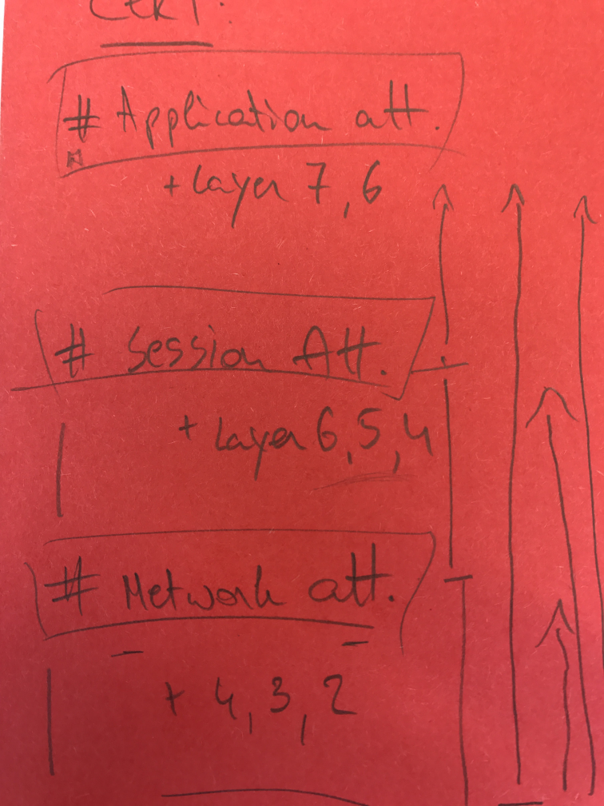

# 拒绝服务

## 介绍

本文的重点是提供一个全面、通用的概述，并提供一个信息丰富、直截了当的指导，就如何在不同层面上抵御拒绝服务（DoS）攻击提出一些观点。它绝不是完整的，但是，它应该作为一个指标，通知读者，并介绍一个可行的方法来解决这个问题。 

--[D] 后续我会单独开一个仓库，从3层协议开始，就关于如何利用各层协议实现DOS，如何实现DDOS，CC的攻击和防御展开描述，并分享一些优秀的工具资源

### 基本原理

考虑到anto-DoS方法不是一步到位的解决方案，很明显，为了实施它，有必要在您的组织中涉及不同的场景，以评估实际情况并相应地应用对策。这些场景涉及包括：应用程序和基础架构领域的开发人员和架构师 等人员。

信息安全中的关键概念围绕 [CIA triad](https://whatis.techtarget.com/definition/Confidentiality-integrity-and-availability-CIA)标准或属性发展. 字母**A**代表可用性，是我们的焦点。DoS的核心本质是通过任何方式影响实例或对象的可用性，并最终使其无法访问。因此，任何信息系统要达到其目的，必须随时可用。因此，互操作流程中的每个计算系统都必须正确运行才能实现这一点。

为了保持弹性和抵抗力，须（建议）根据功能、体系结构和性能（即应用程序、基础架构和网络相关）对库存中的组件进行概述和全面分析。

从预防的角度来看，清楚地了解如何处理适当的组件以解决关键问题（例如瓶颈等）非常重要。这就是为什么对你的环境有一个坚实的了解对于建立一个合适的防御机制是至关重要的。这些可以与以下内容相一致：

1. 缩放选项（**向上**=内部硬件组件，**向外**=完整组件的数量）

2. 现有的概念/逻辑技术（如应用冗余度量、 bulk-heading等，这将扩展您的内部能力）

3. 适用于您的情况的成本分析

在本文件中，我们将遵循特定的指导结构，以说明如何根据您的情况分析此主题。这绝不是一个完整的方法，但我们应该创建基本的模块，这些模块应该用来帮助您构建适合您需要的anti-DoS概念。

### 通用类别和基本控制

在本备忘单中，我们将遵守CERT-EU记录的DDOS分类。该文件将7个OSI模型层划分为三个主要攻击类别，即应用程序、会话和网络。

**TODO:** Add Diagram

应用程序攻击的重点是通过耗尽资源或使应用程序在功能上不可用而达成目的。会话（或协议）攻击的重点是消耗服务器资源，或防火墙和负载平衡器等中间设备的资源。网络（或容量）攻击的重点是使网络资源的带宽饱和。重要的是要了解，在设计DoS弹性解决方案时，需要考虑这三种攻击类别中的每一种。

请注意，OSI模型第1层和第2层不包括在此分类中。本着全面概述所有DoS类型攻击的精神，我们将很快讨论这些层以及DoS如何应用于这些层。

物理层由网络硬件传输技术组成。它是网络中高级功能逻辑数据结构的基础层。典型的DoS场景是破坏、阻塞、故障。一个例子是，一名格鲁吉亚老年妇女切断了一条地下电缆，导致整个亚美尼亚的互联网瘫痪。

数据层是在广域网（WAN）中的相邻网络节点之间或同一局域网（LAN）段上的节点之间传输数据的协议层。典型的拒绝服务场景是MAC洪泛（针对交换机MAC表）和ARP中毒。

在MAC泛洪攻击中，交换机中充斥着数据包，每个数据包都有不同的源MAC地址。其目的是消耗交换机用于存储MAC和物理端口转换表（MAC表）的有限内存。结果是有效的MAC地址被清除，交换机进入故障转移模式，在该模式下它将充当网络集线器。然后将所有数据转发到所有端口，导致数据泄漏。

在ARP中毒攻击中，恶意参与者通过网络发送伪造的ARP（地址解析协议）消息。结果是攻击者的MAC地址可以链接到网络上合法设备的IP地址。这使得攻击者能够截获、修改或停止传输中的数据，这些数据是针对受害者IP地址的。ARP协议特定于局域网，可能会在有线通信中造成拒绝服务。

TODO

包过滤技术可用于检查传输中的包，以识别和阻止违规的ARP包。另一种方法是使用静态ARP表，但它们很难维护。

## 应用攻击

应用层攻击的重点是通过耗尽资源或使应用程序在功能不可用。这些攻击不一定要消耗网络带宽才能有效。相反，它们会给应用服务器带来操作压力，使服务器变得不可用或无法正常工作。利用OSI第7层协议栈上的弱点进行的所有攻击通常被归类为应用程序攻击。它们最难识别/缓解。

**TODO:** List all attacks per category. Because we cannot map remediations one on one with an attack vector, we will first need to list them before discussing the action points

**慢速HTTP** 是一种DoS攻击类型，HTTP请求发送速度非常慢，且碎片化，每次发送一个。在HTTP请求完全交付之前，服务器将在等待丢失的传入数据时占用了资源。在某一时刻，服务器将达到最大并发连接池，从而导致拒绝服务。从攻击者的角度来看，慢速HTTP攻击的执行成本很低，因为它们需要最少的资源。=

### 软件设计概念

* **首先进行低成本校验** 首先应考虑实现简单的不占用资源的验证。之后应该执行更昂贵的验证（CPU、内存和带宽）。原因很明显，我们希望尽快减少对这些资源的影响。 
* **优雅降级 **是指在系统或应用程序的某些部分中断时保持功能的能力。由应用程序终止引起的DoS是一个普遍存在的问题。实现容错设计使系统或应用程序能够在系统的某个部分出现故障时继续其预期操作，可能是在降低的级别上，而不是完全失败。在应用程序设计阶段，为了限制DoS的影响，优雅的降级是一个核心概念。 
* **防止单点故障** 
* **避免高CPU消耗操作** 
* **保持排队时间短** 
* **处理异常** 
* **保护正溢和负溢** 
* **线程**：避免等待大型任务完成后才继续进行的操作。异步操作 
* 确定资源密集型操作并提前计划 
* --[D] 基于RegDos的防御 不要使用存在DOS风险的正则表达式，通用的正则表达式不应让用户可控

### 会话

* **基于不活跃和达到最终超时限制服务器端每个会话时间**：（资源耗尽）虽然会话超时大部分是讨论会话安全和防止会话劫持，但它也是防止资源耗尽的重要措施。 

* **限制会话绑定信息存储：**链接到会话的数据越少，用户会话对Web服务器性能的负担就越小。 

### 输入验证

* **限制文件上传大小和扩展名**（资源耗尽）防止文件空间存储占满或其他web应用程序功能例如，图像大小调整、PDF创建等）将上传内容作为输入导致DoS（-[检查表](https://owasp.org/www-community/vulnerabilities/Unrestricted_File_Upload).

* **限制总请求大小**（资源耗尽），使消耗资源的DoS攻击更难成功。

* **防止基于输入的资源分配**（资源耗尽）。 

  > 例如，输入100 分配100M， 这种资源分配可以被用户可控的场景需要被防御  --[D]

* **防止基于输入的功能和线程交互**（资源耗尽）。用户输入可能会影响函数需要执行的次数，或者CPU消耗的强度。根据（未过滤的）用户输入进行资源分配，可以通过资源耗尽实现DoS场景。

* **基于输入的人机校验** 如验证码或简单的数学问题通常用于“保护”web表单。它们的作用是防止功能滥用。经典的例子是一个webform，它会在发布请求后发送一封电子邮件。验证码可以防止邮箱被恶意攻击者或垃圾邮件淹没。请注意，这种技术无助于防御DoS攻击。

### 访问控制

* **身份验证作为公开功能的手段** 

* **用户锁定** 是一种攻击者可以利用应用程序安全机制通过滥用登录失败导致拒绝服务的情况。 

## 网络攻击

**TODO:** (Develop text) Attacks where network bandwidth gets saturation. Volumetric in nature. Amplification techniques make these attacks effective.

**TODO:** (list attacks) NTP amplification, DNS amplification, UDP flooding, TCP flooding

### 网络设计概念

* **防止单点故障** 

* **池** 

* **缓存** 是存储数据的概念，以便可以更快地满足未来对该数据的请求。通过缓存提供的数据越多，应用程序对带宽耗尽的适应能力就越强。 

* **托管在不同域上的静态资源** 将减少web应用程序上的http请求数。图像和JavaScript是典型的从不同域上加载的文件。 

### 速率限制

速率限制是控制通信速率到达服务器或组件的过程。它可以在基础设施和应用程序级别上实现。速率限制可以基于（非法）IP、IP黑名单列表、地理位置等。 

* **定义最低入口数据速率限制**，丢弃所有低于该速率以下连接。请注意，如果速率限制设置得太低，可能会影响客户。检查日志以建立真实流量率的基线。（针对慢速HTTP攻击的保护）

* **定义绝对连接超时**

* **定义最大入口数据速率限制**，丢弃高于该速率的所有连接。

* **定义总带宽大小限制** 防止带宽耗尽

* **定义负载限制** 在任何给定时间允许访问任何给定资源的用户数量

### ISP级补救措施

* **使用边界路由器过滤无效的发送方地址** 根据RFC 2267 过滤掉以绕过黑名单列表为目标的IP欺骗攻击
* **事先检查您的ISP服务是否存在DDOS问题**（支持多个互联网接入点、足够的带宽（xx xxx Gbit/s）以及用于应用程序级流量分析和防御的特殊硬件

### 全球级补救措施：商业云过滤服务 

* 考虑使用过滤服务以抵抗更大的攻击（高达500 Gb/s） 

* **过滤服务 **支持不同的机制来过滤恶意或不符合要求的流量 

* **遵守相关数据保护/隐私法** 许多提供商路由流量经过美国/英国

## 相关文章

- [CERT-EU Whitepaper](http://cert.europa.eu/static/WhitePapers/CERT-EU-SWP_14_09_DDoS_final.pdf)