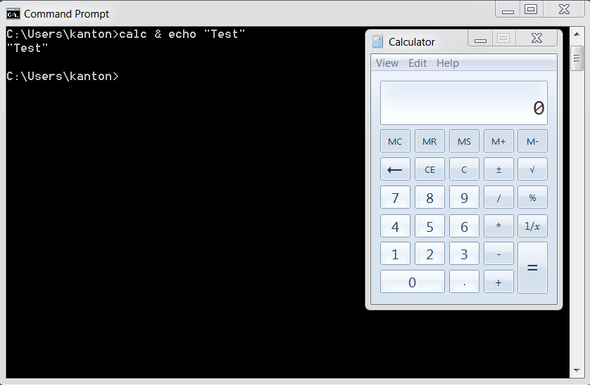

# 防范OS命令注入

## 介绍

命令注入（或OS命令注入）是一种注入类型，其中，使用外部可控输入构建系统命令的软件无法正确处理特殊元素的输入，在初始命令基础上构建出预期命令。

例如，如果提供的值为：

``` shell
calc
```

在Windows命令提示符下键入时，将显示应用程序*计算器*。 

但是，如果提供的值已被篡改，现在是：

``` shell
calc & echo "test"
```

当上述执行时，会改变初始预期值的含义。

现在，将同时显示*计算器*应用程序和值*test*：



如果被破坏的进程没有遵循最小权限原则，并且攻击者控制的命令最终系统特权运行，则问题会更加严重。 

## 主要防御

### 防御选项1: 避免直接调用OS命令

主要的防御措施是避免直接调用OS命令。内置函数库是操作系统命令的一个很好的替代品，因为它们不能被操纵来执行其功能以外的任务。

例如，使用`mkdir()`代替`system("mkdir /dir_name")`。

如果您使用的语言有可用的库或API，这是首选方法。

### 防御选项2: 于对应操作系统的命令做对应的转义

**TODO: To enhance.**

例如, 看到PHP的 [escapeshellarg()](https://www.php.net/manual/en/function.escapeshellarg.php) 或[escapeshellcmd()](https://www.php.net/manual/en/function.escapeshellcmd.php) .

### 防御选项3: 参数化输入

如果无法避免调用包含用户提供的系统命令，则应在软件中使用以层级防御以防止攻击：

#### 第一层

**参数化** - 如果可用，请使用结构化机制自动强制执行数据和命令之间的分离。这些机制可以帮助提供相关的引用、编码。 

#### 第二层 2

**输入验证** - 应验证命令值和相关参数。命令及其参数的需要验证程度不同:

- 对于使用的**命令**，必须根据允许的命令列表对其进行验证
- 对于命令的**参数**，应使用以下选项对其进行验证：
  - 正向或“白名单”输入验证 - 明确定义了允许的参数 Positive or "allow list" input validation - where are the arguments allowed explicitly defined
  - 白名单正则表达式 - 其中显式定义了允许的良好字符列表和字符串的最大长度。确保像 **& | ; $ > < \` \ !** 这样的元字符不是正则表达式的一部分。例如，以下正则表达式只允许小写字母和数字，不包含元字符。长度也被限制为3-10个字符：`^[a-z0-9]{3,10}$`
- 对于命令的**参数值**, 应单引号包裹，并对变量里的单引号转义为 `\'\\\'\`  -- [D] (可以思考下为什么不是转义为`\'`, 后续有机会展开分享)

#### 第三层  --[D]

对于命令的**参数值**, 应单引号包裹，并对变量里的单引号转义为 `\'\\\'\` (可以思考下为什么不是转义为`\'`, 后续有机会展开分享)


## 补充防御

除了主要防御、参数化和输入验证之外，我们还建议采用所有这些额外防御来提供纵深防御。

这些额外的防御措施包括：

* 应用程序应在完成必要任务所需的最低权限运行
* 如果可能，创建仅用于单个任务的有限权限的独立帐户

## 代码示例

### Java

在JAVA下, 使用 [ProcessBuilder](https://docs.oracle.com/javase/8/docs/api/java/lang/ProcessBuilder.html) 命令必须与其参数分开。

*注意关于JAVA `Runtime.exec` 方法的行为:*

有许多网站会告诉您，Java的`Runtime.exec`与`C`语言的system函数完全相同。事实并非如此。两者都允许您调用新的程序/流程。

但是，`C`的system函数将其参数传递给shell（`/bin/sh`）进行解析，而`Runtime.exec`则尝试将字符串拆分为一个单词数组，然后执行数组中的第一个单词，其余单词作为参数。

**`Runtime.exec`在任何时候都不尝试调用shell，并且不支持shell元字符**。

关键区别在于，shell提供的许多可用于恶意破坏的功能（使用`&`、`&&`、` |`、` || `等链接命令，重定向输入和输出）最终将作为参数传递给第一个命令，可能导致语法错误或作为无效参数抛出。

*测试代码:*

``` java
String[] specialChars = new String[]{"&", "&&", "|", "||"};
String payload = "cmd /c whoami";
String cmdTemplate = "java -version %s " + payload;
String cmd;
Process p;
int returnCode;
for (String specialChar : specialChars) {
    cmd = String.format(cmdTemplate, specialChar);
    System.out.printf("#### TEST CMD: %s\n", cmd);
    p = Runtime.getRuntime().exec(cmd);
    returnCode = p.waitFor();
    System.out.printf("RC    : %s\n", returnCode);
    System.out.printf("OUT   :\n%s\n", IOUtils.toString(p.getInputStream(),
                      "utf-8"));
    System.out.printf("ERROR :\n%s\n", IOUtils.toString(p.getErrorStream(),
                      "utf-8"));
}
System.out.printf("#### TEST PAYLOAD ONLY: %s\n", payload);
p = Runtime.getRuntime().exec(payload);
returnCode = p.waitFor();
System.out.printf("RC    : %s\n", returnCode);
System.out.printf("OUT   :\n%s\n", IOUtils.toString(p.getInputStream(),
                  "utf-8"));
System.out.printf("ERROR :\n%s\n", IOUtils.toString(p.getErrorStream(),
                  "utf-8"));
```

*测试结果:*

```text
##### TEST CMD: java -version & cmd /c whoami
RC    : 0
OUT   :

ERROR :
java version "1.8.0_31"

##### TEST CMD: java -version && cmd /c whoami
RC    : 0
OUT   :

ERROR :
java version "1.8.0_31"

##### TEST CMD: java -version | cmd /c whoami
RC    : 0
OUT   :

ERROR :
java version "1.8.0_31"

##### TEST CMD: java -version || cmd /c whoami
RC    : 0
OUT   :

ERROR :
java version "1.8.0_31"

##### TEST PAYLOAD ONLY: cmd /c whoami
RC    : 0
OUT   :
mydomain\simpleuser

ERROR :
```

*错误用法:*

```java
ProcessBuilder b = new ProcessBuilder("C:\DoStuff.exe -arg1 -arg2");
```

在本例中，命令和参数作为一个字符串传递，从而易于操作该表达式和注入的恶意字符串。 

*正确用法:*

下面时更正后的工作目录启动流程的示例。命令和每个参数分别传递。这使得验证每个术语变得容易，并降低了插入恶意字符串的风险。

``` java
ProcessBuilder pb = new ProcessBuilder("TrustedCmd", "TrustedArg1", "TrustedArg2");

Map<String, String> env = pb.environment();

pb.directory(new File("TrustedDir"));

Process p = pb.start();
```

### .Net

在.Net 使用 [System.Diagnostics.Process.Start](https://docs.microsoft.com/en-us/dotnet/api/system.diagnostics.process.start?view=netframework-4.7.2) 调用底层操作系统函数。

``` csharp
System.Diagnostics.Process process = new System.Diagnostics.Process();

System.Diagnostics.ProcessStartInfo startInfo = new System.Diagnostics.ProcessStartInfo();

startInfo.FileName = "validatedCommand";

startInfo.Arguments = "validatedArg1 validatedArg2 validatedArg3";

process.StartInfo = startInfo;

process.Start();
```

### PHP

在PHP中使用 [escapeshellarg()](https://www.php.net/manual/en/function.escapeshellarg.php) 或 [escapeshellcmd()](https://www.php.net/manual/en/function.escapeshellcmd.php) 而非 [exec()](https://www.php.net/manual/en/function.exec.php), [system()](https://www.php.net/manual/en/function.system.php), [passthru()](https://www.php.net/manual/en/function.passthru.php).

## 相关文章

### 命令注入漏洞的描述

- OWASP [Command Injection](https://owasp.org/www-community/attacks/Command_Injection).

### 如何规避漏洞

- C Coding: [Do not call system()](https://wiki.sei.cmu.edu/confluence/pages/viewpage.action?pageId=87152177).

### 如何评审代码

- OWASP [Reviewing Code for OS Injection](https://wiki.owasp.org/index.php/Reviewing_Code_for_OS_Injection).

### 如何挖掘

- [OWASP Testing Guide](https://owasp.org/www-project-web-security-testing-guide/) article on [Testing for Command Injection](https://owasp.org/www-project-web-security-testing-guide/stable/4-Web_Application_Security_Testing/07-Input_Validation_Testing/12-Testing_for_Command_Injection.html).

### 外部参考

- [CWE Entry 77 on Command Injection](https://cwe.mitre.org/data/definitions/77.html).