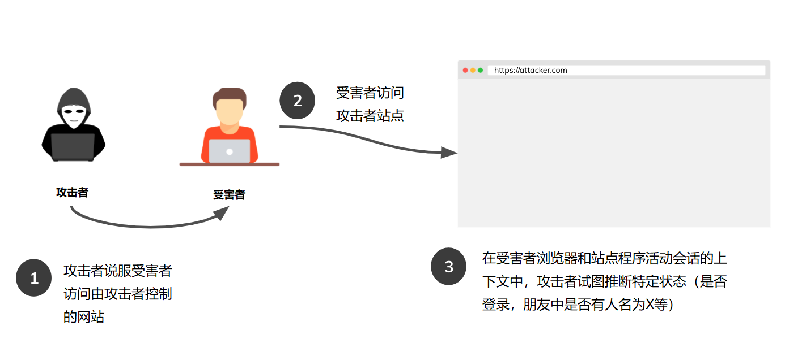
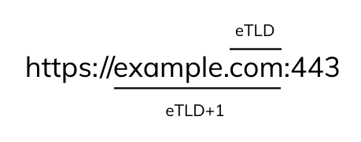
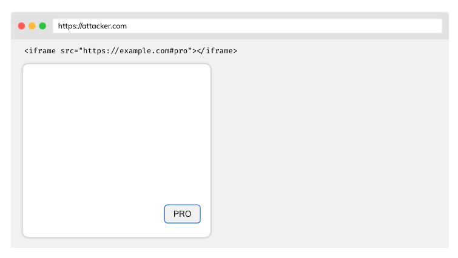
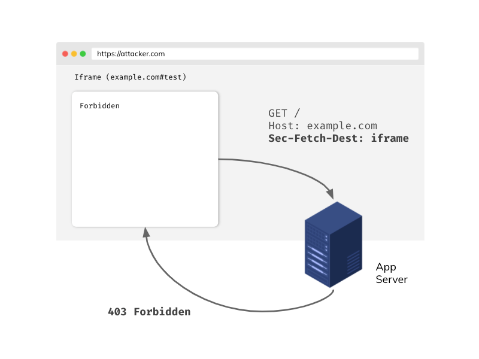
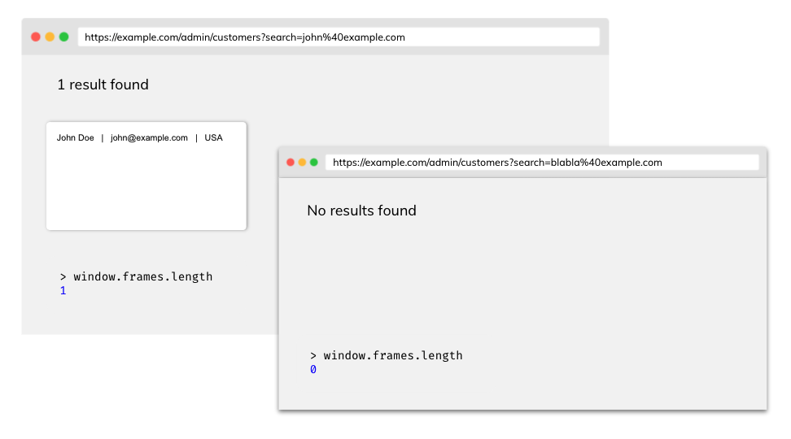
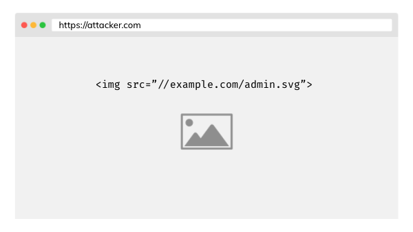

# 防范跨站泄露(xs-leak)

## 介绍

This article describes examples of attacks and defenses against cross-site leaks vulnerability (XS Leaks). Since this vulnerability is based on the core mechanism of modern web browsers, it's also called a browser side-channel attack. XS-Leaks attacks seek to exploit the fact of seemingly insignificant information that is exchanged in cross-site communications between sites. This information infers answers to the previously asked questions about the victim's user account. Please take a look at the examples provided below:

* 当前用户是否登录？
* 用户ID是否为1337？
* 用户是否为管理员？
* 用户的联系人列表中是否具有特定电子邮件地址的人？

根据这些问题，攻击者可能会根据应用程序的上下文推断答案。在大多数情况下，答案将以二进制形式（是或否）给出。此漏洞的影响在很大程度上取决于应用程序的风险状况。尽管如此，XS泄密可能对用户隐私和匿名性构成真正的威胁。

## 攻击向量



- 整个攻击过程发生于受害者的浏览器下-类似于XSS攻击
- 在某些情况下，受害者必须在攻击者的网站上停留较长的时间，才能使攻击成功


## 同源策略 (SOP)

在介绍攻击之前，最好先了解浏览器中最关键的安全机制之一-同源策略。几个关键方面： 

- 如果两个URL的**协议**、**端口**和**主机(IP/子域名)**相同，则认为它们是**的源相同**
- 任何源都可以向另一个源发送请求，但由于相同的源策略，它们将无法直接读取响应
- 可通过[跨源资源共享(CORS)](https://developer.mozilla.org/en-US/docs/Web/HTTP/CORS)来控制同源策略的严格度

| 源 A                  | 源  B                     | 同源?                       |
| --------------------- | ------------------------- | --------------------------- |
| `https://example.com` | `http://sub.example.com`  | 不，host(主机/IP/域名) 不同 |
| `https://example.com` | `https://example.com:443` | 是的! 源A的隐式端口         |

虽然SOP原则保护我们在跨源通信中访问信息，但基于剩余数据的XS泄漏攻击可以推断出一些有价值的信息。 


## SameSite Cookies

cookie的SameSite属性告诉浏览器是否应该在来自其他站点的请求中包含cookie。SameSite属性有以下值：

- `None` - cookie将附加到其他站点发起的请求，但必须通过安全HTTPS通道发送
- `Lax` - 如果请求方法为GET，并且请求为顶级导航（即导航更改浏览器顶栏中的地址），则cookie将附加到来自另一个页面的请求中
- `Strict` - cookie永远不会从其他站点发送

这里值得一提的是，基于Chromium的浏览器的态度是，默认情况下未设置SameSite属性的cookie被视为`Lax` 。

具有适当SameSite属性的Cookie提供**强大的防御**应对XS泄漏和[CSRF攻击](./Cross-Site_Request_Forgery_Prevention_Cheat_Sheet.md) 。


### 如何得知两个站点间的SameSite属性?



在SameSite属性的上下文中，我们将站点视为TLD（顶级域）及其前面的域名的组合。例如： 

| 完整的URL                                 | 根域(eTLD+1)  |
| ----------------------------------------- | ------------- |
| `https://example.com:443/data?query=test` | `example.com` |

为什么我们谈论的是eTLD+1，而不仅仅是TLD+1？这是因为像`github.io`或`eu.org`这样的域的原子性不足，不能很好的进行比较说明。为此，一种“有效”的TLDs（ETLDs）列表被创造了出来，可在[此处](https://publicsuffix.org/list/public_suffix_list.dat)找到。 （[D] e 即 effective, etld详细参考https://juejin.cn/post/6844904098148384776，可以将etld理解为公共认可的后缀)

对于拥有相同eTLD+1的站点被认为满足SameSite，例如:

| 源A                  | 源B                  | SameSite?                    |
| ------------------------- | -------------------------- | ---------------------        |
| `https://example.com`     | `http://example.com`       | 是, 协议无关紧要 |
| `https://evil.net`        | `https://example.com`      | 否, eTLD+1不同       |
| `https://sub.example.com` | `https://data.example.com` | 是, 子域名无关紧要 |

关于SameSite的更多信息，阅读优秀文章 [Understanding "same-site"](https://web.dev/same-site-same-origin/).


## 攻击方式1：使用元素ID属性

DOM中的元素在document中具有唯一的ID属性。例如： 

```html
<button id="pro">Pro account</button>
```

如果我们在URL中添加属性值，浏览器将自动聚焦到给定ID的元素上，例如`https://example.com#pro`会有下图效果. JavaScript[焦点事件](https://developer.mozilla.org/en-US/docs/Web/API/Element/focus_event)搞砸了更多的事情。攻击者会尝试在其自己的受控页面所嵌入的iframe中设置特定的源(src属性值)：



然后在主document 中添加侦听器, 观察[模糊事件](https://developer.mozilla.org/en-US/docs/Web/API/Element/blur_event)(焦点的反向事件) 。当受害者访问攻击者部署的恶意页面时，就会触发blur(模糊)事件。攻击者将能够断定受害者拥有pro帐户。 ([D] 可以理解下，即攻击者提前分析了example.com，发现若拥有Pro账号的用户，其页面会有pro这个ID属性，因此可以利用上述技巧判断该用户是否拥有Pro账号)


### 防御措施

#### Framing保护

如果不允许其他源站将你的站点嵌入其frame中，可以考虑使用以下两种机制之一： 

- **Content Security Policy frame ancestors** 指令. [Read more about syntax](https://developer.mozilla.org/en-US/docs/Web/HTTP/Headers/Content-Security-Policy/frame-src).
- **X-Frame-Options**  -  主要是如果您想支持旧浏览器。 

设置framing保护可有效阻止攻击者控制的源站上的frame中嵌入自己的站点程序，并可防止其他攻击，如[点击劫持](https://cheatsheetseries.owasp.org/cheatsheets/Clickjacking_Defense_Cheat_Sheet.html)。

#### Fetch元数据 (Sec-Fetch-Dest)

Sec-Fetch-Dest头为我们提供了一条关于最终目标请求的信息。此标头由浏览器自动包含，并且是Fetch元数据标准中的标头之一。 

使用Sec-Fetch-Dest，您可以构建有效的自有资源隔离策略，例如：

```javascript
app.get('/', (req, res) => {
    if (req.get('Sec-Fetch-Dest') === 'iframe') {
        return res.sendStatus(403);
    }
    res.send({
        message: 'Hello!'
    });
});
```



如果要使用Fetch元数据标准中的标头，请确保用户的浏览器支持此标准（您可以在[此处](https://caniuse.com/?search=sec-fetch)进行检查）。此外，如果请求中未包含Sec Fetch-*头，请考虑在代码中使用适当的回退。


## 攻击方式2：基于错误事件

通常，在页面中是允许嵌入来自其他源的资源。例如，您可以在页面上嵌入来自其他来源的图像，甚至脚本。

但是，由于SOP政策，不会允许读取跨来源资源响应的数据。

当浏览器发送资源请求时，服务器处理该请求并决定响应，例如（200 OK或404 NOT FOUND）。浏览器接收HTTP响应，并在此基础上触发相应的JavaScript事件（onload或onerror）。


通过这种方式，我们可以尝试加载资源，并根据响应状态推断它们是否存在于登录受害者的上下文中。让我们看看以下情况：

- `GET /api/user/1234` - 200 OK - 当前登录的用户是1234，因为我们成功加载了资源（[onload](https://developer.mozilla.org/en-US/docs/Web/API/GlobalEventHandlers/onload)已触发事件）
- `GET /api/user/1235` - 401 Unauthorized  - 1234不是当前登录用户的ID（[onerror](https://developer.mozilla.org/en-US/docs/Web/API/GlobalEventHandlers/onerror)事件将被触发） 

在上述示例中，攻击者可以在其受控源上使用JavaScript，通过在一个简单循环中枚举所有值来猜测受害者的ID。

```javascript
function checkId(id) {
    const script = document.createElement('script');
    script.src = `https://example.com/api/users/${id}`;
    script.onload = () => {
        console.log(`Logged user id: ${id}`);
    };
    document.body.appendChild(script);
}

// Generate array [0, 1, ..., 40]
const ids = Array(41)
    .fill()
    .map((_, i) => i + 0);

for (const id of ids) {
    checkId(id);
}
```

请注意，此处的攻击者并不关心读取响应正文，即使由于浏览器中的可靠隔离机制（如[跨源资源阻止](https://www.chromium.org/Home/chromium-security/corb-for-developers)）而无法读取响应正文，而攻击者所需要的只是获取 `onload` 事件是否成功触发的信息。

### 防御措施

#### 子资源保护

在某些情况下，可以实现特殊的唯一令牌机制来保护我们的敏感端点（接口)。

```
/api/users/1234?token=be930b8cfb5011eb9a030242ac130003
```

- Token 需要足够长且唯一
- 后端必须正确验证请求中传递的Token

虽然它非常有效，但该解决方案在适当的实现中会产生很大的开销。

#### Fetch元数据(Sec-Fetch-Site)

此标头表示从何处发送请求，并采用以下值：

- `cross-site`
- `same-origin`
- `same-site`
- `none` - 用户直接访问页面

就像 Sec-Fetch-Dest, 此标头由浏览器自动附加到每个请求，并且是Fetch元数据标准的一部分。示例用法： 

```javascript
app.get('/api/users/:id', authorization, (req, res) => {
    if (req.get('Sec-Fetch-Site') === 'cross-site') {
        return res.sendStatus(403);
    }

    // ... more code

    return res.send({ id: 1234, name: 'John', role: 'admin' });
});
```

#### Cross-Origin-Resource-Policy (CORP)

如果服务器返回带有对应值的此标头，浏览器将不会从我们的站和源下的（甚至静态图像）资源加载给其他人的站点。可能的值：

- `same-site`
- `same-origin`
- `cross-origin`

阅读更多CORP，[here](https://resourcepolicy.fyi/).


## 攻击方式3：利用postMessage通信

有时在受控情况下，我们希望在不同源之间交换信息。我们可以使用postMessage机制。请参见以下示例： 

```javascript
// Origin: http://example.com
const site = new URLSearchParams(window.location.search).get('site'); // https://evil.com
const popup = window.open(site);
popup.postMessage('secret message!', '*');

// Origin: https://evil.com
window.addEventListener('message', e => {
    alert(e.data) // secret message! - leak
});
```

### 防御

#### 指定严格的targetOrigin

要避免出现上述情况，即攻击者通过window的事件监听接收消息，请始终在postMessage中指定确切的`targetOrigin`。传递到`targetOrigin`是正确的，而留空或者通配符`*`会导致任何源可以接收消息。

```javascript
// Origin: http://example.com
const site = new URLSearchParams(window.location.search).get('site'); // https://evil.com
const popup = window.open(site);
popup.postMessage('secret message!', 'https://sub.example.com');

// Origin: https://evil.com
window.addEventListener('message', e => {
    alert(e.data) // no data!
});
```


## 攻击方式4：利用Frame计数

有关window中加载frame的数量信息可能是泄漏源。以将搜索结果加载到frame中的程序为例，如果结果为空，则frame不会显示。



攻击者可以通过 `window.frames` 对象返回的的frame数来获取有关window中已加载的frame数的信息。


例如，攻击者可以获取电子邮件列表，通过在简单的循环枚举，打开子window并计算frame数。如果打开的窗口中的frame数等于1，则电子邮件位于受害者使用的客户端数据库中。

### 防御

#### Cross-Origin-Opener-Policy (COOP)

设置此标头将阻止在同一浏览上下文组中打开跨源document。此解决方案确保打开另一个document的document将无法访问`window`对象。可能的值：

- `unsafe-none`
- `same-origin-allow-popups`
- `same-origin`

如果服务器返回例如`same-origin`的COOP标头，则攻击将失败：

```javascript
const win = window.open('https://example.com/admin/customers?search=john%40example.com');
console.log(win.frames.length) // Cannot read property 'length' of null
```


## 攻击方式5：利用浏览器缓存

浏览器缓存有助于显著减少重新访问页面时加载页面所需的时间。然而，它也可能造成信息泄漏的风险。如果攻击者能够获取资源的加载时间之后，就可以基于此得出是否从缓存中加载了资源，并由此推断处一些信息与结论。


原理很简单，从缓存加载的资源的加载速度将比从服务器加载的速度快得多。



攻击者可以在其站点上嵌入资源，该资源只能由具有管理员角色的用户访问。然后，使用JavaScript读取特定资源的加载时间，并根据此信息推断资源是否在缓存中。

```javascript
    // Threshold above which we consider a resource to have loaded from the server
    // const THRESHOLD = ...

    const adminImagePerfEntry = window.performance
        .getEntries()
        .filter((entry) => entry.name.endsWith('admin.svg'));

    if (adminImagePerfEntry.duration < THRESHOLD) {
        console.log('Image loaded from cache!')
    }
```

### 防御

#### 图像的不可预测标记

当用户希望仍缓存资源，而攻击者无法找到token时，此技术是准确的。

```
/avatars/admin.svg?token=be930b8cfb5011eb9a030242ac130003
```

- Tokens在每个用户的上下文中应该是唯一的
- 如果攻击者猜不到该Token，则无法检测资源是否已从缓存加载

#### 使用 Cache-Control 头

如果您接受每次用户访问站点时都需要从服务器重新加载资源导致的性能下降，则可以禁用缓存机制。要禁用所需保护的资源的缓存，请设置响应标头`Cache-Control: no-store`.。


## 小贴士

- 如果应用程序使用Cookie，请确保设置适当的[SameSite属性](#samesite-cookies)。
- 考虑是否真的希望将站点嵌入到frame中。如果没有，请考虑使用[frame保护](#Framing保护)一节中描述的机制。
- 要加强站点页面在其他源之间的隔离，请使用具有适当值的[跨源资源策略 (CORP)](#Cross-Origin-Resource-Policy (CORP))和[跨源开放器策略(COOP)](#Cross-Origin-Opener-Policy (COOP))标头。 
- 使用Fetch元数据中可用的头来构建您自己的资源隔离策略。


## 参考

### XS Leaks

- [XS Leaks Wiki](https://xsleaks.dev/)
- [XS Leaks Attacks & Prevention](https://www.appsecmonkey.com/blog/xs-leaks)

### Fetch Metadata

- [Fetch Metadata and Isolation Policies](https://www.appsecmonkey.com/blog/fetch-metadata)
- [Protect your resources from attacks with Fetch Metadata](https://web.dev/fetch-metadata/)

### Framing protection

- [Preventing framing with policies](https://pragmaticwebsecurity.com/articles/securitypolicies/preventing-framing-with-policies.html)
- [CSP 'frame-ancestors' policy](https://content-security-policy.com/frame-ancestors/)

### SameSite

- [SameSite cookies explained](https://web.dev/samesite-cookies-explained/)
- [SameSite cookies recipes](https://web.dev/samesite-cookie-recipes/)

### COOP and CORP header

- [Making your site "cross-origin isolated"](https://web.dev/coop-coep/)
- [MDN Web Docs about CORP](https://developer.mozilla.org/en-US/docs/Web/HTTP/Cross-Origin_Resource_Policy_%28CORP%29)